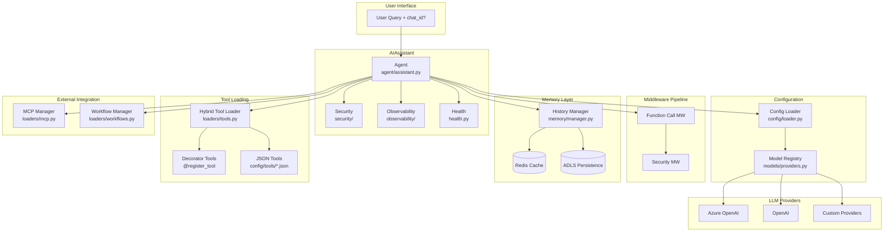
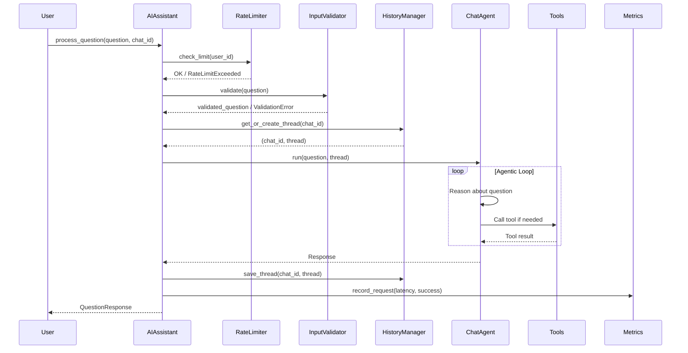
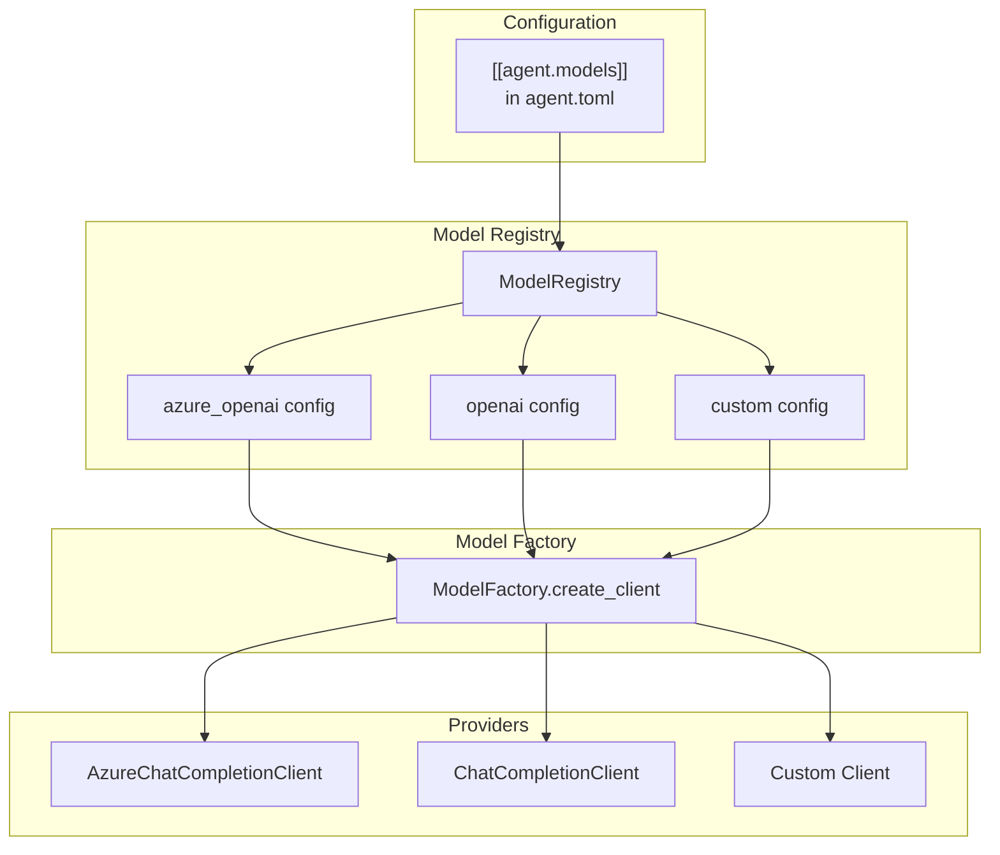
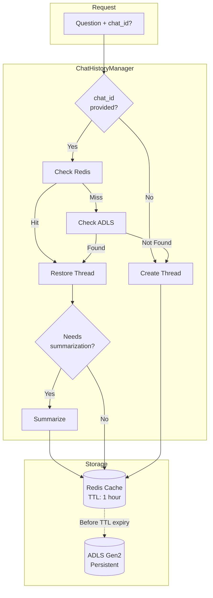
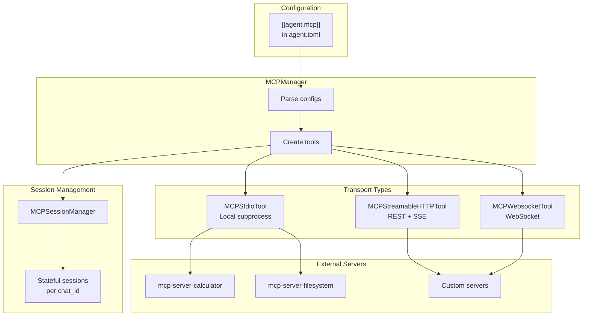
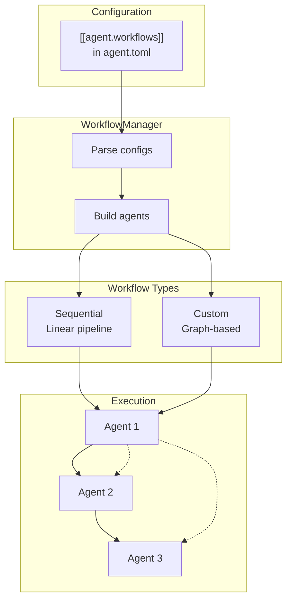
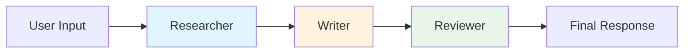
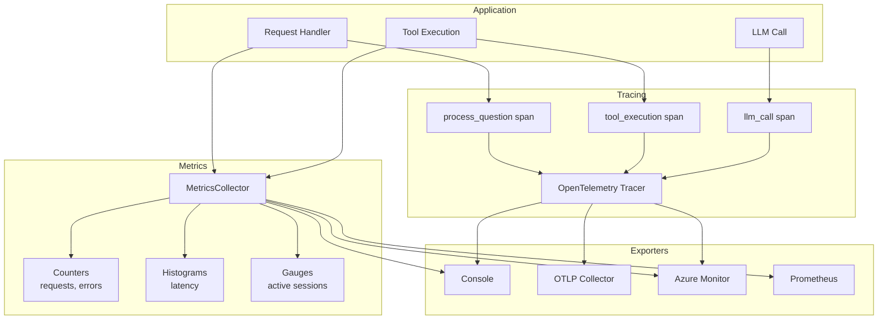
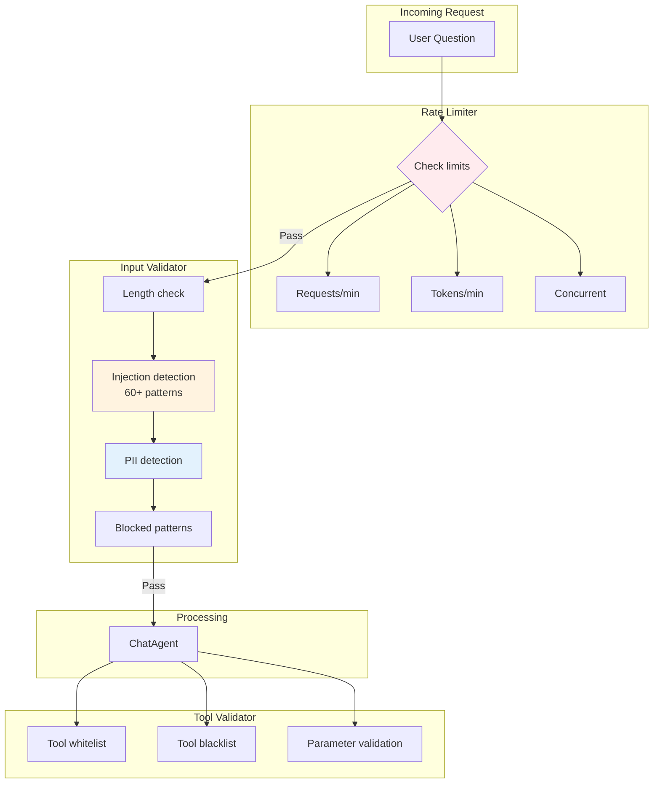

# MSFT Agent Framework Architecture

Detailed architectural documentation for the Microsoft Agent Framework template.

## System Overview



## Core Components

| Component | File | Responsibility |
|-----------|------|----------------|
| **AIAssistant** | `agent/assistant.py` | Main orchestrator, question processing, lifecycle |
| **AgentConfig** | `config/loader.py` | TOML loading, validation, environment overrides |
| **ModelRegistry** | `models/providers.py` | Multi-model provider management |
| **ToolLoader** | `loaders/tools.py` | Hybrid tool discovery (decorator + JSON) |
| **MCPManager** | `loaders/mcp.py` | MCP server connections (stdio/http/ws) |
| **WorkflowManager** | `loaders/workflows.py` | Multi-agent workflow orchestration |
| **ChatHistoryManager** | `memory/manager.py` | Session management, cache + persistence |
| **RedisCache** | `memory/cache.py` | Azure Cache for Redis with AAD auth |
| **ADLSPersistence** | `memory/persistence.py` | ADLS Gen2 long-term storage |
| **InputValidator** | `security/input_validator.py` | Prompt injection, PII detection |
| **RateLimiter** | `security/rate_limiter.py` | Request and token rate limiting |
| **HealthChecker** | `health.py` | Component health monitoring |
| **TracingConfig** | `observability/tracing.py` | OpenTelemetry distributed tracing |
| **MetricsCollector** | `observability/metrics.py` | Request/tool/error metrics |

## Request Flow



## Tool Loading Architecture

The framework supports hybrid tool loading with decorator tools taking precedence.

```mermaid
graph TB
    subgraph "Configuration"
        TOML[agent.toml<br/>tool_modules list]
        JSOND[config/tools/*.json<br/>Tool definitions]
    end

    subgraph "Decorator Discovery"
        MODS[Import Modules]
        SCAN[@register_tool scan]
        REG[Tool Registry]
    end

    subgraph "JSON Discovery"
        JSONL[Load JSON files]
        SVC[Find service.py]
        CLASS[Find Service class]
    end

    subgraph "Merge & Register"
        MERGE[Merge tools<br/>Decorators win conflicts]
        BIND[Bind to ChatAgent]
    end

    TOML --> MODS
    MODS --> SCAN
    SCAN --> REG
    JSOND --> JSONL
    JSONL --> SVC
    SVC --> CLASS
    REG --> MERGE
    CLASS --> MERGE
    MERGE --> BIND

    style SCAN fill:#e8f5e9
    style MERGE fill:#fff3e0
```

### Decorator Pattern (Recommended)

```python
from src.tools import ai_function, register_tool, Annotated, Field

@register_tool(name="my_tool", tags=["utilities"])
@ai_function
def my_tool(
    param: Annotated[str, Field(description="Parameter description")],
) -> str:
    """Tool docstring becomes LLM's understanding."""
    return f"Result: {param}"
```

### JSON + Service Pattern (Legacy)

```
config/tools/weather.json  →  src/weather/service.py  →  WeatherService.run()
```

## Multi-Model Architecture



**Configuration:**

```toml
[[agent.models]]
name = "gpt-4o"
provider = "azure_openai"
model = "gpt-4o"
endpoint = "https://your-resource.openai.azure.com/"
default = true

[[agent.models]]
name = "gpt-4o-mini"
provider = "azure_openai"
model = "gpt-4o-mini"
```

**Usage:**

```python
# Use default model
result = await assistant.process_question("Hello")

# Use specific model
result = await assistant.process_question("Hello", model="gpt-4o-mini")

# Get client directly
client = assistant.get_chat_client("gpt-4o-mini")
```

## Memory & Session Management



**Session Flow:**

| chat_id | Cache | ADLS | Action |
|---------|-------|------|--------|
| None | - | - | Generate UUID, create thread |
| Provided | Hit | - | Restore from cache |
| Provided | Miss | Found | Load from ADLS, cache it |
| Provided | Miss | Not Found | Create new with provided ID |

See [memory.md](memory.md) for detailed configuration.

## MCP Integration



## Workflow Architecture



**Sequential Workflow:**



## Observability Architecture



See [observability.md](observability.md) for configuration details.

## Security Architecture



See [security.md](security.md) for configuration details.

## Health Check System

```mermaid
graph TB
    subgraph "Health Endpoints"
        READY[/health/ready<br/>Readiness probe]
        LIVE[/health/live<br/>Liveness probe]
        FULL[/health<br/>Full status]
    end

    subgraph "HealthChecker"
        CHK[check_all]
        CACHE_R[Cache results<br/>10s TTL]
    end

    subgraph "Component Checks"
        C_REDIS[Redis ping]
        C_ADLS[ADLS access]
        C_MCP[MCP tools count]
        C_LLM[LLM connectivity]
    end

    subgraph "Status"
        S_OK[HEALTHY]
        S_DEG[DEGRADED]
        S_ERR[UNHEALTHY]
    end

    READY --> CHK
    LIVE --> CHK
    FULL --> CHK
    CHK --> CACHE_R
    CACHE_R --> C_REDIS
    CACHE_R --> C_ADLS
    CACHE_R --> C_MCP
    CACHE_R --> C_LLM
    C_REDIS --> S_OK
    C_REDIS --> S_DEG
    C_ADLS --> S_ERR
```

**Response Format:**

```json
{
  "status": "healthy",
  "timestamp": "2025-01-15T10:30:00Z",
  "version": "1.0.0",
  "uptime_seconds": 3600.5,
  "components": [
    {"name": "redis", "status": "healthy", "latency_ms": 2.5},
    {"name": "adls", "status": "healthy", "latency_ms": 45.2},
    {"name": "mcp", "status": "healthy", "latency_ms": 0.1, "details": {"tool_count": 5}}
  ]
}
```

## Data Flow Summary

1. **User Query** → AIAssistant receives question + optional `chat_id`
2. **Rate Limiting** → Check request/token limits
3. **Input Validation** → Detect injection, PII, blocked content
4. **Session Lookup** → ChatHistoryManager: cache → ADLS → create new
5. **Configuration** → Load TOML, environment overrides
6. **Tool Loading** → Decorator tools + JSON tools (hybrid)
7. **MCP Loading** → Connect to external MCP servers
8. **Workflow Loading** → Build multi-agent pipelines
9. **Agent Creation** → Initialize ChatAgent with tools + middleware
10. **Processing** → LLM reasons and calls tools as needed
11. **Summarization** → Compress context if token limit exceeded
12. **Session Save** → Update cache, persist to ADLS before TTL
13. **Metrics** → Record latency, success, tool calls
14. **Response** → Final answer + `chat_id` returned to user
