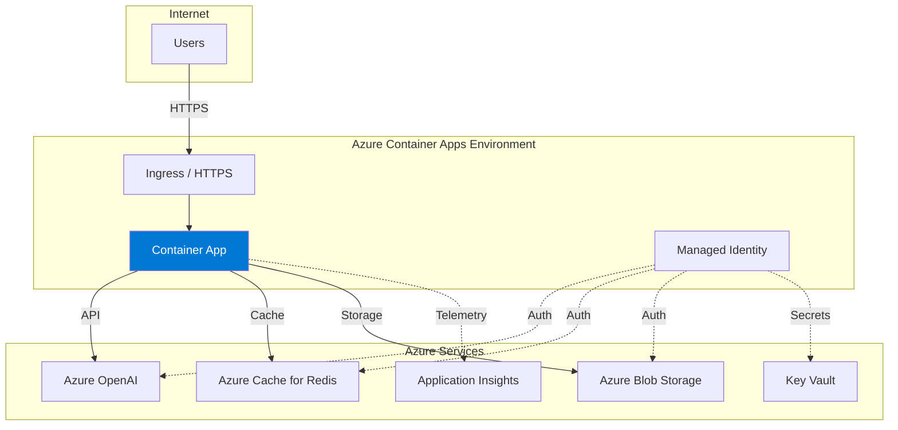

# Azure Deployment

This guide covers deploying the MSFT Agent Framework using Azure platform services.

## Overview

Azure provides multiple deployment options for containerized applications:

| Service | Best For | Management | Scaling |
|---------|----------|------------|---------|
| **Azure Container Apps** | Serverless containers | Fully managed | Auto-scale to zero |
| **Azure App Service** | Simple web apps | Fully managed | Manual + Auto-scale |
| **Azure Kubernetes Service** | Full Kubernetes | Semi-managed | HPA + Cluster autoscaler |

## Prerequisites

- Azure subscription with required permissions
- Azure CLI installed (`az --version`)
- Docker image pushed to Azure Container Registry (ACR)
- Azure OpenAI resource deployed

### Push Image to ACR

```bash
# Login to Azure
az login

# Create ACR (if needed)
az acr create --resource-group myResourceGroup --name myregistry --sku Basic

# Login to ACR
az acr login --name myregistry

# Build and push
cd deployment
docker build -t myregistry.azurecr.io/msft-agent-framework:1.0.0 -f Dockerfile ..
docker push myregistry.azurecr.io/msft-agent-framework:1.0.0
```

---

## Azure Container Apps

Azure Container Apps is the recommended option for most deployments. It provides serverless containers with built-in autoscaling, HTTPS ingress, and Dapr integration.

### Architecture



### Deploy with Azure CLI

```bash
# Create resource group
az group create --name rg-msft-agent --location eastus

# Create Container Apps environment
az containerapp env create \
  --name cae-msft-agent \
  --resource-group rg-msft-agent \
  --location eastus

# Create managed identity
az identity create \
  --name id-msft-agent \
  --resource-group rg-msft-agent

# Get identity details
IDENTITY_ID=$(az identity show --name id-msft-agent --resource-group rg-msft-agent --query id -o tsv)
IDENTITY_CLIENT_ID=$(az identity show --name id-msft-agent --resource-group rg-msft-agent --query clientId -o tsv)

# Grant identity access to Azure OpenAI
az role assignment create \
  --role "Cognitive Services OpenAI User" \
  --assignee-object-id $(az identity show --name id-msft-agent --resource-group rg-msft-agent --query principalId -o tsv) \
  --scope /subscriptions/{subscription-id}/resourceGroups/{openai-rg}/providers/Microsoft.CognitiveServices/accounts/{openai-account}

# Create Container App
az containerapp create \
  --name ca-msft-agent \
  --resource-group rg-msft-agent \
  --environment cae-msft-agent \
  --image myregistry.azurecr.io/msft-agent-framework:1.0.0 \
  --registry-server myregistry.azurecr.io \
  --user-assigned $IDENTITY_ID \
  --target-port 8000 \
  --ingress external \
  --min-replicas 1 \
  --max-replicas 10 \
  --cpu 1.0 \
  --memory 2.0Gi \
  --env-vars \
    AZURE_OPENAI_ENDPOINT=https://your-resource.openai.azure.com/ \
    AZURE_OPENAI_DEPLOYMENT=gpt-4o \
    AZURE_CLIENT_ID=$IDENTITY_CLIENT_ID \
    LOG_LEVEL=INFO
```

### Deploy with Bicep

```bicep
// main.bicep
param location string = resourceGroup().location
param environmentName string = 'cae-msft-agent'
param appName string = 'ca-msft-agent'
param imageName string = 'myregistry.azurecr.io/msft-agent-framework:1.0.0'
param azureOpenAIEndpoint string
param azureOpenAIDeployment string = 'gpt-4o'

// Managed Identity
resource managedIdentity 'Microsoft.ManagedIdentity/userAssignedIdentities@2023-01-31' = {
  name: 'id-${appName}'
  location: location
}

// Container Apps Environment
resource environment 'Microsoft.App/managedEnvironments@2023-05-01' = {
  name: environmentName
  location: location
  properties: {
    zoneRedundant: true
    workloadProfiles: [
      {
        name: 'Consumption'
        workloadProfileType: 'Consumption'
      }
    ]
  }
}

// Container App
resource containerApp 'Microsoft.App/containerApps@2023-05-01' = {
  name: appName
  location: location
  identity: {
    type: 'UserAssigned'
    userAssignedIdentities: {
      '${managedIdentity.id}': {}
    }
  }
  properties: {
    managedEnvironmentId: environment.id
    configuration: {
      ingress: {
        external: true
        targetPort: 8000
        transport: 'http'
        allowInsecure: false
      }
      registries: [
        {
          server: 'myregistry.azurecr.io'
          identity: managedIdentity.id
        }
      ]
    }
    template: {
      containers: [
        {
          name: 'agent'
          image: imageName
          resources: {
            cpu: json('1.0')
            memory: '2Gi'
          }
          env: [
            { name: 'AZURE_OPENAI_ENDPOINT', value: azureOpenAIEndpoint }
            { name: 'AZURE_OPENAI_DEPLOYMENT', value: azureOpenAIDeployment }
            { name: 'AZURE_CLIENT_ID', value: managedIdentity.properties.clientId }
            { name: 'LOG_LEVEL', value: 'INFO' }
          ]
          probes: [
            {
              type: 'Readiness'
              httpGet: {
                path: '/health/ready'
                port: 8000
              }
              initialDelaySeconds: 10
              periodSeconds: 10
            }
            {
              type: 'Liveness'
              httpGet: {
                path: '/health/live'
                port: 8000
              }
              initialDelaySeconds: 15
              periodSeconds: 20
            }
          ]
        }
      ]
      scale: {
        minReplicas: 1
        maxReplicas: 10
        rules: [
          {
            name: 'http-scaling'
            http: {
              metadata: {
                concurrentRequests: '50'
              }
            }
          }
        ]
      }
    }
  }
}

output appUrl string = 'https://${containerApp.properties.configuration.ingress.fqdn}'
output identityClientId string = managedIdentity.properties.clientId
```

Deploy:

```bash
az deployment group create \
  --resource-group rg-msft-agent \
  --template-file main.bicep \
  --parameters azureOpenAIEndpoint='https://your-resource.openai.azure.com/'
```

### Scaling Configuration

Container Apps supports multiple scaling rules:

```bash
# HTTP concurrent requests
az containerapp update \
  --name ca-msft-agent \
  --resource-group rg-msft-agent \
  --scale-rule-name http-rule \
  --scale-rule-type http \
  --scale-rule-http-concurrency 50

# CPU utilization
az containerapp update \
  --name ca-msft-agent \
  --resource-group rg-msft-agent \
  --scale-rule-name cpu-rule \
  --scale-rule-type cpu \
  --scale-rule-metadata type=Utilization value=70
```

---

## Azure App Service

Azure App Service provides a simpler deployment model with built-in CI/CD, deployment slots, and easy scaling.

### Architecture


### Deploy with Azure CLI

```bash
# Create App Service Plan
az appservice plan create \
  --name asp-msft-agent \
  --resource-group rg-msft-agent \
  --is-linux \
  --sku P1v3

# Create Web App
az webapp create \
  --name wa-msft-agent \
  --resource-group rg-msft-agent \
  --plan asp-msft-agent \
  --deployment-container-image-name myregistry.azurecr.io/msft-agent-framework:1.0.0

# Enable managed identity
az webapp identity assign \
  --name wa-msft-agent \
  --resource-group rg-msft-agent

# Configure app settings
az webapp config appsettings set \
  --name wa-msft-agent \
  --resource-group rg-msft-agent \
  --settings \
    AZURE_OPENAI_ENDPOINT=https://your-resource.openai.azure.com/ \
    AZURE_OPENAI_DEPLOYMENT=gpt-4o \
    WEBSITES_PORT=8000 \
    LOG_LEVEL=INFO

# Configure health check
az webapp config set \
  --name wa-msft-agent \
  --resource-group rg-msft-agent \
  --generic-configurations '{"healthCheckPath": "/health/ready"}'

# Enable container logging
az webapp log config \
  --name wa-msft-agent \
  --resource-group rg-msft-agent \
  --docker-container-logging filesystem
```

### Deployment Slots

Use slots for zero-downtime deployments:

```bash
# Create staging slot
az webapp deployment slot create \
  --name wa-msft-agent \
  --resource-group rg-msft-agent \
  --slot staging

# Deploy to staging
az webapp config container set \
  --name wa-msft-agent \
  --resource-group rg-msft-agent \
  --slot staging \
  --docker-custom-image-name myregistry.azurecr.io/msft-agent-framework:1.1.0

# Swap to production
az webapp deployment slot swap \
  --name wa-msft-agent \
  --resource-group rg-msft-agent \
  --slot staging \
  --target-slot production
```

---

## Azure Kubernetes Service

AKS provides full Kubernetes capabilities with Azure integration. See [Kubernetes Deployment](kubernetes.md) for detailed manifests.

### Quick AKS Setup

```bash
# Create AKS cluster
az aks create \
  --resource-group rg-msft-agent \
  --name aks-msft-agent \
  --node-count 3 \
  --enable-managed-identity \
  --enable-workload-identity \
  --enable-oidc-issuer \
  --network-plugin azure \
  --generate-ssh-keys

# Get credentials
az aks get-credentials --resource-group rg-msft-agent --name aks-msft-agent

# Attach ACR
az aks update \
  --resource-group rg-msft-agent \
  --name aks-msft-agent \
  --attach-acr myregistry

# Deploy application
kubectl apply -f k8s/
```

---

## Managed Identity Configuration

All Azure deployment options support managed identity for secure, credential-free authentication.

### Grant Permissions

```bash
# Get the managed identity principal ID
# For Container Apps:
PRINCIPAL_ID=$(az containerapp identity show --name ca-msft-agent --resource-group rg-msft-agent --query principalId -o tsv)

# For App Service:
PRINCIPAL_ID=$(az webapp identity show --name wa-msft-agent --resource-group rg-msft-agent --query principalId -o tsv)

# Grant Azure OpenAI access
az role assignment create \
  --role "Cognitive Services OpenAI User" \
  --assignee-object-id $PRINCIPAL_ID \
  --scope /subscriptions/{sub}/resourceGroups/{rg}/providers/Microsoft.CognitiveServices/accounts/{account}

# Grant Redis access
az role assignment create \
  --role "Redis Cache Contributor" \
  --assignee-object-id $PRINCIPAL_ID \
  --scope /subscriptions/{sub}/resourceGroups/{rg}/providers/Microsoft.Cache/redis/{cache}

# Grant Storage access
az role assignment create \
  --role "Storage Blob Data Contributor" \
  --assignee-object-id $PRINCIPAL_ID \
  --scope /subscriptions/{sub}/resourceGroups/{rg}/providers/Microsoft.Storage/storageAccounts/{account}
```

---

## Azure Key Vault Integration

Store secrets securely in Key Vault and reference them in your deployment.

### Setup Key Vault

```bash
# Create Key Vault
az keyvault create \
  --name kv-msft-agent \
  --resource-group rg-msft-agent \
  --enable-rbac-authorization

# Grant managed identity access
az role assignment create \
  --role "Key Vault Secrets User" \
  --assignee-object-id $PRINCIPAL_ID \
  --scope /subscriptions/{sub}/resourceGroups/rg-msft-agent/providers/Microsoft.KeyVault/vaults/kv-msft-agent

# Add secrets
az keyvault secret set --vault-name kv-msft-agent --name azure-openai-endpoint --value "https://your-resource.openai.azure.com/"
```

### Reference in Container Apps

```bash
az containerapp update \
  --name ca-msft-agent \
  --resource-group rg-msft-agent \
  --set-env-vars \
    AZURE_OPENAI_ENDPOINT=secretref:azure-openai-endpoint \
  --secrets azure-openai-endpoint=keyvaultref:https://kv-msft-agent.vault.azure.net/secrets/azure-openai-endpoint,identityref:/subscriptions/{sub}/resourceGroups/rg-msft-agent/providers/Microsoft.ManagedIdentity/userAssignedIdentities/id-msft-agent
```

### Reference in App Service

```bash
az webapp config appsettings set \
  --name wa-msft-agent \
  --resource-group rg-msft-agent \
  --settings \
    AZURE_OPENAI_ENDPOINT="@Microsoft.KeyVault(VaultName=kv-msft-agent;SecretName=azure-openai-endpoint)"
```

---

## Application Insights Integration

Enable observability with Application Insights.

### Setup

```bash
# Create Application Insights
az monitor app-insights component create \
  --app ai-msft-agent \
  --resource-group rg-msft-agent \
  --location eastus

# Get connection string
CONNECTION_STRING=$(az monitor app-insights component show --app ai-msft-agent --resource-group rg-msft-agent --query connectionString -o tsv)

# Add to Container App
az containerapp update \
  --name ca-msft-agent \
  --resource-group rg-msft-agent \
  --set-env-vars \
    APPLICATIONINSIGHTS_CONNECTION_STRING=$CONNECTION_STRING \
    OTEL_SERVICE_NAME=msft-agent-framework
```

---

## Network Configuration

### VNet Integration

For private networking:

```bash
# Create VNet
az network vnet create \
  --name vnet-msft-agent \
  --resource-group rg-msft-agent \
  --address-prefix 10.0.0.0/16 \
  --subnet-name snet-apps \
  --subnet-prefix 10.0.1.0/24

# Create Container Apps environment with VNet
az containerapp env create \
  --name cae-msft-agent \
  --resource-group rg-msft-agent \
  --infrastructure-subnet-resource-id /subscriptions/{sub}/resourceGroups/rg-msft-agent/providers/Microsoft.Network/virtualNetworks/vnet-msft-agent/subnets/snet-apps \
  --internal-only false
```

### Private Endpoints

Create private endpoints for Azure services:

```bash
# Private endpoint for Azure OpenAI
az network private-endpoint create \
  --name pe-openai \
  --resource-group rg-msft-agent \
  --vnet-name vnet-msft-agent \
  --subnet snet-apps \
  --private-connection-resource-id /subscriptions/{sub}/resourceGroups/{rg}/providers/Microsoft.CognitiveServices/accounts/{account} \
  --group-id account \
  --connection-name openai-connection
```

---

## Troubleshooting

### Container Apps

```bash
# View logs
az containerapp logs show --name ca-msft-agent --resource-group rg-msft-agent --follow

# Check revision status
az containerapp revision list --name ca-msft-agent --resource-group rg-msft-agent -o table

# View system logs
az containerapp logs show --name ca-msft-agent --resource-group rg-msft-agent --type system
```

### App Service

```bash
# View logs
az webapp log tail --name wa-msft-agent --resource-group rg-msft-agent

# SSH into container
az webapp ssh --name wa-msft-agent --resource-group rg-msft-agent

# Check deployment status
az webapp deployment show --name wa-msft-agent --resource-group rg-msft-agent
```

---

## Related Documentation

- [Deployment Overview](overview.md) — Compare deployment options
- [Docker Deployment](docker.md) — Container basics
- [Kubernetes Deployment](kubernetes.md) — Full K8s manifests
- [Production Checklist](production-checklist.md) — Pre-deployment verification
- [Azure Setup](../azure-setup.md) — Azure resource configuration

---
*Last updated: 2026-01-17*
