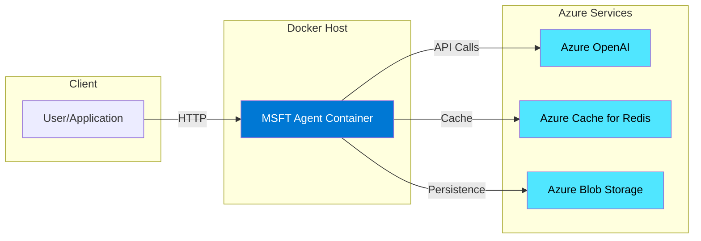
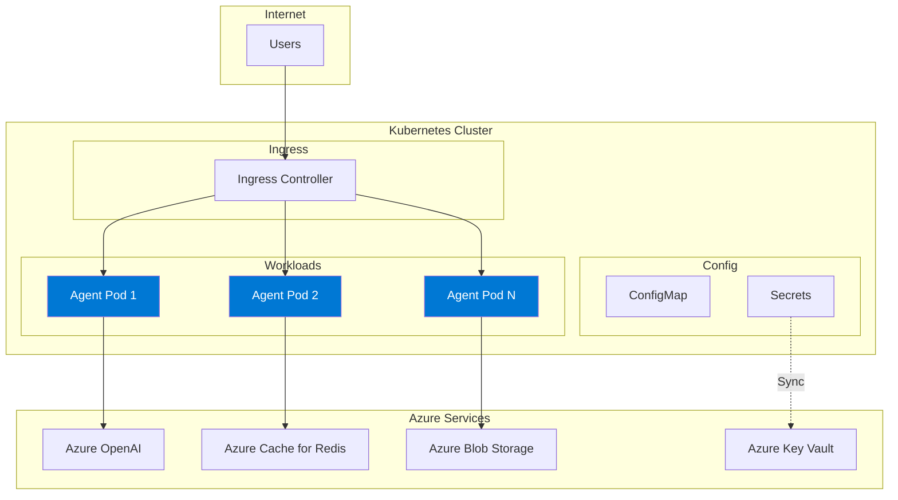
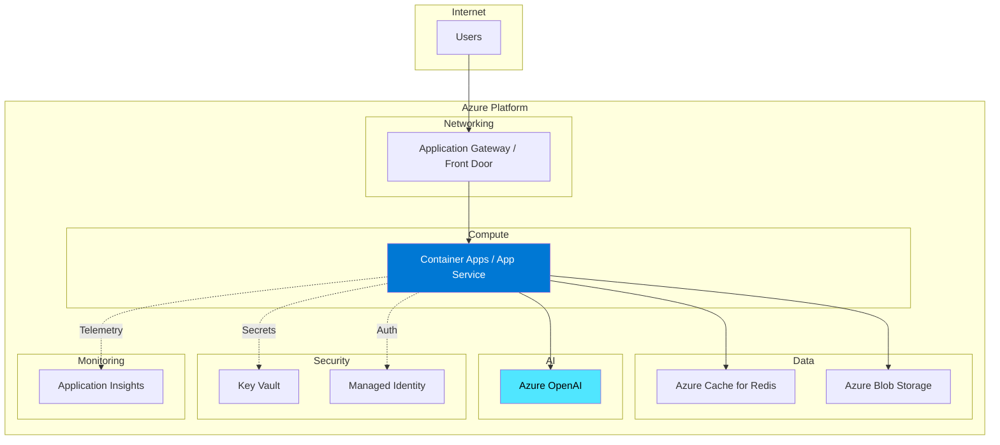
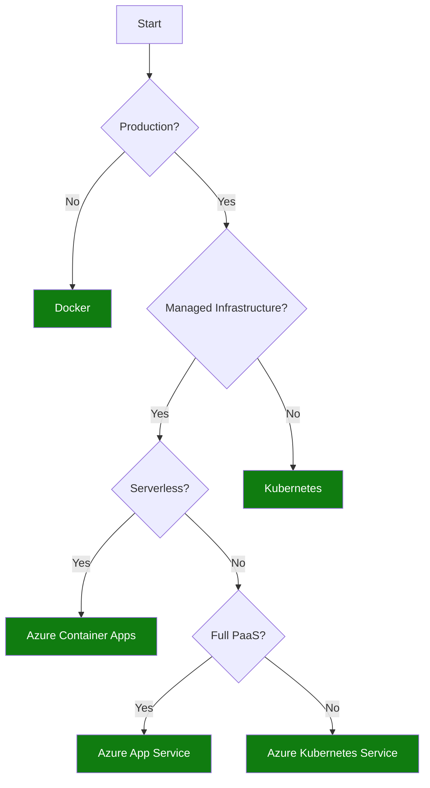

# Deployment Overview

This guide covers the deployment options for the MSFT Agent Framework, helping you choose the right approach for your environment.

## Overview

The MSFT Agent Framework can be deployed in multiple ways depending on your infrastructure requirements, scale, and operational preferences.

## Prerequisites

Before deploying, ensure you have:

- **Azure OpenAI Resource** — With a deployed model (e.g., gpt-4o)
- **Azure Identity** — Service principal or managed identity configured
- **Network Access** — Connectivity to Azure services (OpenAI, Redis, ADLS if used)

## Deployment Options Comparison

| Option | Best For | Complexity | Scale | Management |
|--------|----------|------------|-------|------------|
| [Docker](docker.md) | Development, small deployments | Low | Single instance | Manual |
| [Kubernetes](kubernetes.md) | Production, high availability | Medium | Horizontal | Automated |
| [Azure Container Apps](azure-deployment.md#azure-container-apps) | Serverless containers | Low | Auto-scale | Managed |
| [Azure App Service](azure-deployment.md#azure-app-service) | Simple web hosting | Low | Vertical + slots | Managed |
| [Azure Kubernetes Service](azure-deployment.md#azure-kubernetes-service) | Enterprise, full control | High | Horizontal | Semi-managed |

## Architecture Diagrams

### Single Instance Deployment (Docker)

### Kubernetes Deployment (High Availability)

### Azure PaaS Deployment

## Deployment Decision Tree

Use this decision tree to choose the right deployment option:

## Environment Configuration

All deployment options require the same core environment variables:

### Required Variables

| Variable | Description | Example |
|----------|-------------|---------|
| `AZURE_OPENAI_ENDPOINT` | Azure OpenAI endpoint URL | `https://myresource.openai.azure.com/` |
| `AZURE_OPENAI_DEPLOYMENT` | Model deployment name | `gpt-4o` |

### Authentication Variables

For **Managed Identity** (recommended for Azure deployments):

| Variable | Description |
|----------|-------------|
| `AZURE_CLIENT_ID` | Managed identity client ID (user-assigned only) |

For **Service Principal**:

| Variable | Description |
|----------|-------------|
| `AZURE_TENANT_ID` | Azure AD tenant ID |
| `AZURE_CLIENT_ID` | Application (client) ID |
| `AZURE_CLIENT_SECRET` | Client secret |

### Optional Variables

| Variable | Description | Default |
|----------|-------------|---------|
| `REDIS_HOST` | Redis host (overrides config) | From `agent.toml` |
| `REDIS_PORT` | Redis port | `6380` |
| `ADLS_ACCOUNT_NAME` | Storage account name | From `agent.toml` |
| `LOG_LEVEL` | Logging level | `INFO` |

## Health Endpoints

All deployments expose the same health check endpoints:

| Endpoint | Purpose | Response |
|----------|---------|----------|
| `/health` | Full health check | `{"status": "healthy", "components": [...]}` |
| `/health/ready` | Readiness probe | `200 OK` or `503 Service Unavailable` |
| `/health/live` | Liveness probe | `200 OK` |

Use these endpoints for:
- **Kubernetes probes** — Configure readinessProbe and livenessProbe
- **Load balancer health** — Route traffic only to healthy instances
- **Monitoring alerts** — Trigger alerts on degraded status

## Security Considerations

Regardless of deployment option:

1. **Never expose credentials in code** — Use environment variables or Key Vault
2. **Use Managed Identity** — Eliminates credential management for Azure resources
3. **Network isolation** — Deploy in VNet with private endpoints where possible
4. **TLS everywhere** — Encrypt all traffic in transit
5. **Least privilege** — Grant only required permissions to identity

## Next Steps

Choose your deployment guide:

- **[Docker Deployment](docker.md)** — Local development and simple deployments
- **[Kubernetes Deployment](kubernetes.md)** — Production Kubernetes clusters
- **[Azure Deployment](azure-deployment.md)** — Azure PaaS options (Container Apps, App Service, AKS)
- **[Production Checklist](production-checklist.md)** — Pre-deployment verification

## Related Documentation

- [Architecture](../architecture.md) — System architecture and component overview
- [Security](../security.md) — Security features and best practices
- [Observability](../observability.md) — Monitoring and tracing setup

---
*Last updated: 2026-01-17*
