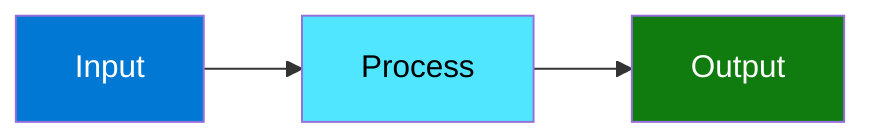

# Contributing Guide

This guide covers how to contribute to the MSFT Agent Framework.

## Development Setup

### Prerequisites

- Python 3.10+
- Git
- Azure CLI (for testing)

### Clone and Install

```bash
# Clone repository
git clone https://github.com/your-org/MSFT-AGENT-FRAMEWORK.git
cd MSFT-AGENT-FRAMEWORK

# Create virtual environment
python -m venv .venv
source .venv/bin/activate  # Windows: .venv\Scripts\activate

# Install with dev dependencies
pip install -e ".[dev]"
```

### Verify Setup

```bash
# Run tests
pytest tests/ -v

# Run linting
ruff check src/
black --check src/

# Run type checking
mypy src/
```

---

## Code Standards

### Formatting

We use **Black** for formatting and **Ruff** for linting:

```bash
# Format code
black src/ tests/

# Check linting
ruff check src/ tests/

# Fix linting issues
ruff check --fix src/ tests/
```

Configuration in `pyproject.toml`:

```toml
[tool.black]
line-length = 100
target-version = ["py310", "py311", "py312"]

[tool.ruff]
line-length = 100
select = ["E", "F", "I", "W"]
```

### Type Hints

Use type hints for all function signatures:

```python
# Good
async def process_question(
    self,
    question: str,
    chat_id: str | None = None,
    user_id: str | None = None,
) -> QuestionResponse:
    ...

# Bad
async def process_question(self, question, chat_id=None, user_id=None):
    ...
```

Run type checking:

```bash
mypy src/
```

### Docstrings

Use Google-style docstrings:

```python
def calculate_tokens(text: str, model: str = "gpt-4") -> int:
    """Calculate token count for text.

    Args:
        text: The input text to tokenize.
        model: The model to use for tokenization.

    Returns:
        The number of tokens in the text.

    Raises:
        ValueError: If the model is not supported.
    """
    ...
```

### Imports

Organize imports with `ruff`:

```python
# Standard library
import asyncio
from dataclasses import dataclass

# Third party
import structlog
from pydantic import BaseModel

# Local
from src.config import AgentConfig
from src.tools import ai_function
```

---

## Project Structure

```
src/
├── agent/              # Core agent module
│   ├── __init__.py
│   ├── assistant.py    # AIAssistant class
│   └── middleware.py   # Request middleware
├── config/             # Configuration loading
├── loaders/            # Tool and MCP loaders
├── memory/             # Session management
├── models/             # Multi-model registry
├── observability/      # Tracing and metrics
├── security/           # Security features
├── tools/              # Tool utilities
└── health.py           # Health checks

tests/
├── unit/               # Unit tests
├── integration/        # Integration tests
└── conftest.py         # Pytest fixtures
```

---

## Making Changes

### Branch Naming

- `feature/` — New features
- `fix/` — Bug fixes
- `docs/` — Documentation
- `refactor/` — Code refactoring
- `test/` — Test additions/fixes

Example: `feature/add-anthropic-support`

### Commit Messages

Use conventional commits:

```
feat: add Anthropic Claude support
fix: handle empty response from Azure OpenAI
docs: update MCP integration guide
test: add unit tests for tool loader
refactor: simplify configuration loading
```

### Pull Request Process

1. Create a branch from `main`
2. Make your changes
3. Run tests: `pytest tests/ -v`
4. Run linting: `ruff check src/ && black --check src/`
5. Update documentation if needed
6. Submit PR with description

### PR Description Template

```markdown
## Summary
Brief description of changes.

## Changes
- Change 1
- Change 2

## Testing
- [ ] Unit tests pass
- [ ] Integration tests pass (if applicable)
- [ ] Manually tested

## Documentation
- [ ] Updated relevant docs
- [ ] Added docstrings
```

---

## Testing

### Running Tests

```bash
# All tests
pytest tests/ -v

# Unit tests only
pytest tests/unit/ -v

# Integration tests
pytest tests/integration/ -v

# With coverage
pytest tests/ -v --cov=src --cov-report=html
```

### Writing Tests

```python
# tests/unit/test_assistant.py
import pytest
from src.agent import AIAssistant

@pytest.fixture
def mock_config():
    return AgentConfig(...)

@pytest.mark.asyncio
async def test_process_question(mock_config):
    async with AIAssistant(config=mock_config) as assistant:
        result = await assistant.process_question("Hello")
        assert result.response is not None
        assert result.chat_id is not None
```

### Test Markers

```python
@pytest.mark.slow           # Slow tests
@pytest.mark.integration    # Integration tests
@pytest.mark.asyncio        # Async tests
```

Run specific markers:

```bash
pytest -m "not slow"        # Skip slow tests
pytest -m integration       # Only integration tests
```

See [Testing Guide](testing.md) for more details.

---

## Adding Features

### Adding a New Tool

1. Create tool function:

```python
# src/tools/my_tool.py
from src.tools import ai_function, register_tool

@register_tool(tags=["utilities"])
@ai_function
def my_tool(query: str) -> str:
    """Tool description."""
    return f"Result: {query}"
```

2. Add to tool modules in config:

```toml
[agent.tools]
tool_modules = ["src.tools.my_tool"]
```

3. Write tests:

```python
# tests/unit/test_my_tool.py
def test_my_tool():
    result = my_tool("test")
    assert "Result: test" in result
```

### Adding a Model Provider

1. Create provider class in `src/models/`:

```python
# src/models/providers/my_provider.py
from src.models.base import BaseModelProvider

class MyProvider(BaseModelProvider):
    async def complete(self, messages, **kwargs):
        ...
```

2. Register in `src/models/registry.py`:

```python
PROVIDERS["my_provider"] = MyProvider
```

3. Add configuration support in `src/config/models.py`

4. Document in `docs/getting-started/configuration.md`

---

## Documentation

### Building Docs

Documentation is in Markdown format in the `docs/` directory.

### Documentation Standards

- Use headers (`#`, `##`, `###`) for structure
- Include code examples
- Add Mermaid diagrams for architecture
- Link to related docs
- Include "Last updated" date

### Diagram Style

Use Mermaid with consistent colors:

```markdown

```

---

## Release Process

### Version Bump

Update version in `pyproject.toml`:

```toml
[project]
version = "1.1.0"
```

### Changelog

Update `CHANGELOG.md`:

```markdown
## [1.1.0] - 2024-01-15

### Added
- Anthropic Claude support
- New MCP WebSocket transport

### Fixed
- Redis connection timeout issue

### Changed
- Improved error messages
```

### Release Checklist

- [ ] All tests pass
- [ ] Documentation updated
- [ ] Version bumped
- [ ] Changelog updated
- [ ] PR reviewed and approved
- [ ] Tag created

---

## Getting Help

- **Questions**: Open a GitHub Discussion
- **Bugs**: Open a GitHub Issue
- **Security**: Email security@example.com

---

## Code of Conduct

Be respectful and inclusive. See `CODE_OF_CONDUCT.md` for details.

---
*Last updated: 2026-01-17*
