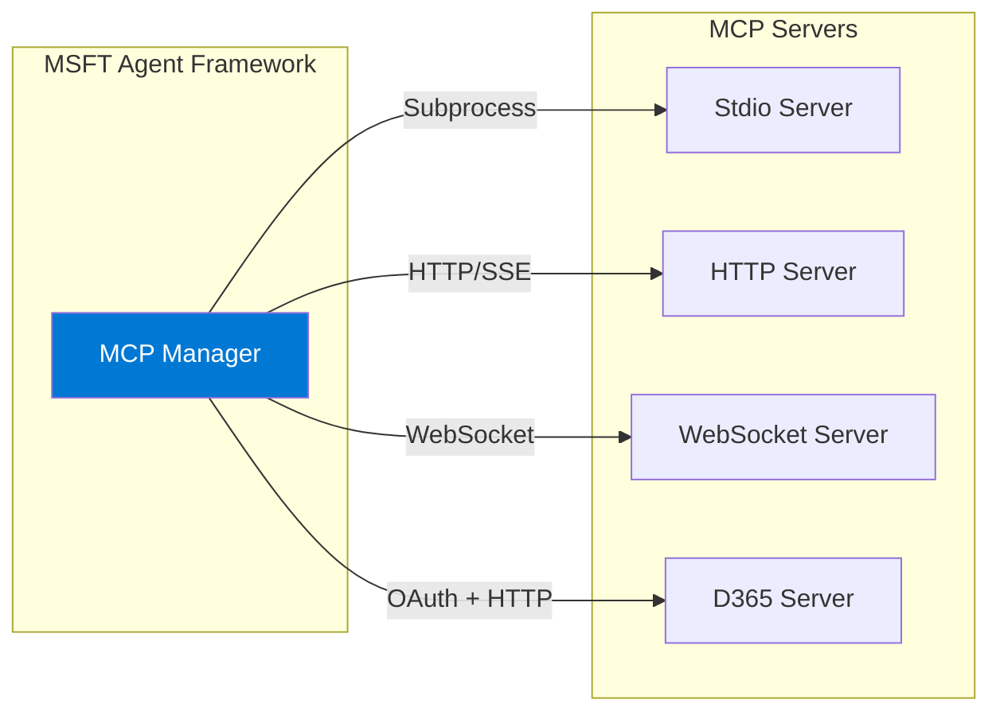

# MCP Integration Guide

This guide covers connecting to Model Context Protocol (MCP) servers to extend your agent's capabilities.

## Overview

MCP (Model Context Protocol) is a standard for connecting AI agents to external tools and data sources. The MSFT Agent Framework supports multiple MCP transport types:

- **Stdio** — Local subprocess servers
- **HTTP/SSE** — Remote HTTP servers with Server-Sent Events
- **WebSocket** — Real-time WebSocket connections
- **D365** — Specialized Dynamics 365 integration with OAuth



## Quick Start

Add an MCP server to `config/agent.toml`:

```toml
[[agent.mcp]]
name = "calculator"
type = "stdio"
enabled = true
command = "uvx"
args = ["mcp-server-calculator"]
```

The tools from this server are automatically available to your agent.

## Transport Types

### Stdio (Local Subprocess)

Stdio servers run as local subprocesses. The agent communicates via stdin/stdout.

**Best for:**
- Local development
- Self-contained tools
- Servers that don't require network access

**Configuration:**

```toml
[[agent.mcp]]
name = "calculator"
type = "stdio"
enabled = true
command = "uvx"                    # Command to run
args = ["mcp-server-calculator"]   # Command arguments
env = { DEBUG = "true" }           # Environment variables (optional)
```

**Examples:**

```toml
# Using uvx (uv's tool runner)
[[agent.mcp]]
name = "filesystem"
type = "stdio"
command = "uvx"
args = ["mcp-server-filesystem", "--allowed-directories", "/data"]

# Using npx
[[agent.mcp]]
name = "puppeteer"
type = "stdio"
command = "npx"
args = ["-y", "@anthropic/mcp-server-puppeteer"]

# Python module
[[agent.mcp]]
name = "custom"
type = "stdio"
command = "python"
args = ["-m", "mytools.mcp_server"]
env = { PYTHONPATH = "/app" }
```

### HTTP/SSE (Server-Sent Events)

HTTP servers communicate over HTTP with SSE for streaming responses.

**Best for:**
- Remote servers
- Shared tool services
- Servers requiring authentication

**Configuration:**

```toml
[[agent.mcp]]
name = "my-api"
type = "http"
enabled = true
url = "https://api.example.com/mcp"
headers = { Authorization = "Bearer ${API_TOKEN}" }
timeout = 60
```

**Fields:**

| Field | Type | Required | Description |
|-------|------|----------|-------------|
| `url` | string | Yes | Server endpoint URL |
| `headers` | table | No | HTTP headers (supports `${VAR}` substitution) |
| `timeout` | integer | No | Request timeout in seconds (default: 30) |

### WebSocket

WebSocket servers maintain persistent connections for real-time communication.

**Best for:**
- Real-time data
- Bi-directional communication
- Long-running operations

**Configuration:**

```toml
[[agent.mcp]]
name = "realtime"
type = "websocket"
enabled = true
url = "wss://api.example.com/mcp"
headers = { Authorization = "Bearer ${API_TOKEN}" }
```

**Fields:**

| Field | Type | Required | Description |
|-------|------|----------|-------------|
| `url` | string | Yes | WebSocket URL (ws:// or wss://) |
| `headers` | table | No | Connection headers |

### D365 (Dynamics 365)

Specialized transport for D365 Finance & Operations with OAuth authentication.

**Best for:**
- D365 F&O integration
- ERP data access
- Business process automation

**Configuration:**

```toml
[[agent.mcp]]
name = "d365-fo"
type = "d365"
enabled = true
description = "D365 Finance & Operations"
timeout = 60

[agent.mcp.oauth]
environment_url = "https://myorg.operations.dynamics.com"
tenant_id = "your-tenant-id"
client_id = "your-client-id"
client_secret = "${D365_CLIENT_SECRET}"
```

See [D365 MCP Setup](../integrations/d365-mcp-setup.md) for detailed configuration.

## Session Management

For stateful MCP servers that maintain session context:

### Enable Sessions

```toml
[agent.mcp_sessions]
enabled = true
session_ttl = 3600          # 1 hour
persist_sessions = true     # Save to ADLS
```

### Stateful HTTP Server

```toml
[[agent.mcp]]
name = "erp-forms"
type = "http"
enabled = true
url = "https://erp.example.com/mcp"
stateful = true                          # Enable session handling
session_header = "X-Session-Id"          # Session ID header
form_context_header = "X-Form-Context"   # Form state header
requires_user_id = true                  # Require user ID
```

### Session Behavior

When sessions are enabled:

1. **Session Creation**: First request creates a new session
2. **Session Persistence**: Session ID is stored in Redis (and optionally ADLS)
3. **Session Reuse**: Subsequent requests from the same `chat_id` reuse the session
4. **Session Expiry**: Sessions expire after `session_ttl` seconds

## Health Checks

MCP servers are included in health checks:

```python
health = await assistant.health_check()
for component in health.components:
    if component.name.startswith("mcp"):
        print(f"{component.name}: {component.status}")
        if component.details:
            print(f"  Tools: {component.details.get('tool_count', 0)}")
```

### MCP Health Status

| Status | Meaning |
|--------|---------|
| `healthy` | Server connected, tools loaded |
| `degraded` | Server connected but some issues |
| `unhealthy` | Server unreachable |

## Tool Discovery

MCP tools are automatically discovered on startup:

```python
async with AIAssistant() as assistant:
    tools = assistant.get_tools()
    for tool in tools:
        if tool.source == "mcp":
            print(f"MCP Tool: {tool.name}")
            print(f"  Server: {tool.mcp_server}")
            print(f"  Description: {tool.description}")
```

### Tool Naming

MCP tools are namespaced by server name:

- Server `calculator` with tool `add` → Tool name: `calculator.add`
- Server `filesystem` with tool `read_file` → Tool name: `filesystem.read_file`

## Error Handling

### Connection Errors

```python
from src.exceptions import MCPConnectionError

try:
    async with AIAssistant() as assistant:
        result = await assistant.process_question("Use the calculator")
except MCPConnectionError as e:
    print(f"MCP server {e.server_name} failed: {e.message}")
```

### Tool Execution Errors

```python
from src.exceptions import ToolExecutionError

try:
    result = await assistant.process_question("Calculate something")
except ToolExecutionError as e:
    if e.tool_name.startswith("calculator."):
        print(f"Calculator error: {e.message}")
```

### Retry Configuration

MCP requests include automatic retry logic:

```toml
[[agent.mcp]]
name = "api"
type = "http"
url = "https://api.example.com/mcp"
retry_attempts = 3
retry_delay = 1.0  # seconds
```

## Advanced Configuration

### Multiple Servers

```toml
[[agent.mcp]]
name = "calculator"
type = "stdio"
command = "uvx"
args = ["mcp-server-calculator"]

[[agent.mcp]]
name = "filesystem"
type = "stdio"
command = "uvx"
args = ["mcp-server-filesystem"]

[[agent.mcp]]
name = "api"
type = "http"
url = "https://api.example.com/mcp"
```

### Conditional Enabling

```toml
[[agent.mcp]]
name = "dev-tools"
type = "stdio"
enabled = false  # Disabled by default
command = "python"
args = ["-m", "dev_tools.server"]
```

Enable via environment:

```python
# In code, modify config before initialization
config.mcp_servers["dev-tools"].enabled = os.getenv("ENABLE_DEV_TOOLS", "false") == "true"
```

### Custom Headers

```toml
[[agent.mcp]]
name = "authenticated-api"
type = "http"
url = "https://api.example.com/mcp"
headers = {
    Authorization = "Bearer ${API_TOKEN}",
    "X-API-Version" = "2024-01",
    "X-Request-ID" = "${REQUEST_ID}"
}
```

## Troubleshooting

### Server Not Starting (Stdio)

```
MCPConnectionError: Failed to start stdio server 'calculator'
```

**Solutions:**
1. Verify command exists: `which uvx` or `where uvx`
2. Check args are correct
3. Test manually: `uvx mcp-server-calculator`
4. Check for dependency issues

### Connection Refused (HTTP/WebSocket)

```
MCPConnectionError: Connection refused to https://api.example.com/mcp
```

**Solutions:**
1. Verify URL is correct
2. Check network connectivity
3. Verify firewall rules
4. Check server is running

### Authentication Errors

```
MCPConnectionError: 401 Unauthorized
```

**Solutions:**
1. Check token/credentials are valid
2. Verify header names are correct
3. Check token expiration
4. Verify required scopes

### Timeout Errors

```
MCPConnectionError: Request timed out after 30s
```

**Solutions:**
1. Increase timeout: `timeout = 60`
2. Check server performance
3. Check network latency
4. Optimize server-side processing

### Debug Logging

Enable debug logging for MCP:

```bash
export LOG_LEVEL=DEBUG
```

Or in configuration:

```toml
[agent]
log_level = "DEBUG"
```

## Best Practices

1. **Use descriptive names** — Server names appear in logs and tool names
2. **Set appropriate timeouts** — Match expected operation duration
3. **Handle errors gracefully** — MCP failures shouldn't crash the agent
4. **Monitor health** — Track MCP server health in dashboards
5. **Secure credentials** — Use environment variables for secrets
6. **Test locally first** — Verify stdio servers work before deployment

## Related Documentation

- [Architecture](../architecture.md) — MCP in system architecture
- [D365 MCP Setup](../integrations/d365-mcp-setup.md) — D365 integration
- [Config Reference](../reference/config-reference.md) — MCP configuration options
- [Tools Guide](../tools.md) — Creating custom tools

---
*Last updated: 2026-01-17*
