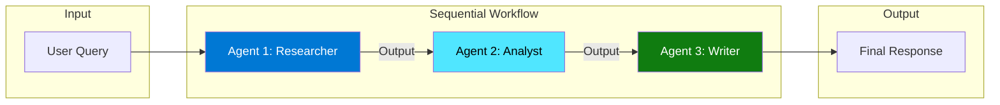
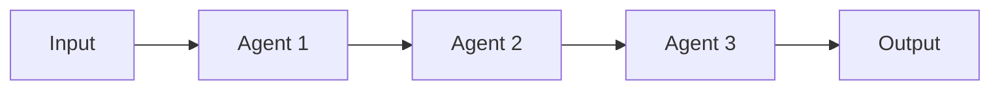
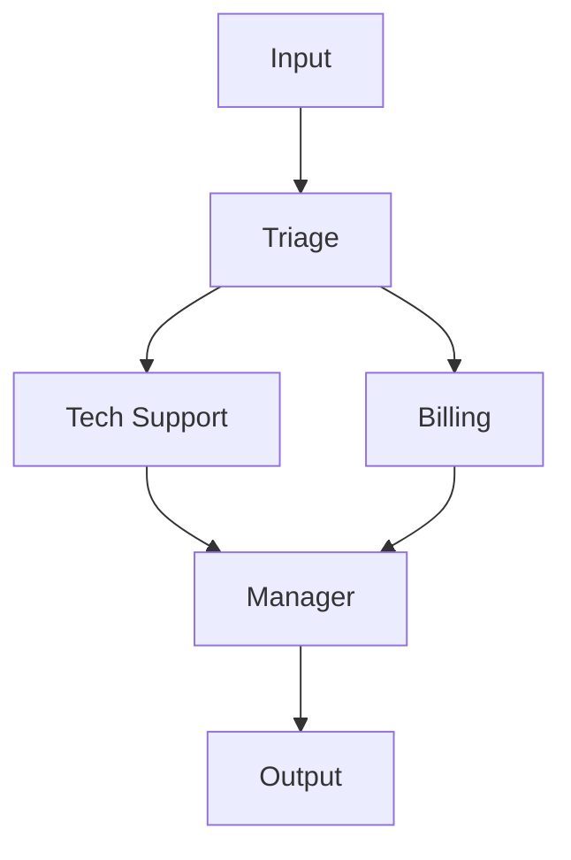

# Multi-Agent Workflows Guide

This guide covers configuring and using multi-agent workflows to orchestrate complex tasks.

## Overview

Workflows allow you to chain multiple AI agents together, where each agent can have different instructions, models, and capabilities. This enables:

- **Task decomposition** — Break complex tasks into specialized steps
- **Multi-model orchestration** — Use different LLMs for different tasks
- **Pipeline processing** — Transform data through multiple stages



## Quick Start

Add a workflow to `config/agent.toml`:

```toml
[[agent.workflows]]
name = "content-pipeline"
type = "sequential"
enabled = true

[[agent.workflows.agents]]
name = "Researcher"
instructions = "Research the topic and provide key facts."

[[agent.workflows.agents]]
name = "Writer"
instructions = "Write engaging content based on the research."
```

Run the workflow:

```python
async with AIAssistant() as assistant:
    result = await assistant.run_workflow(
        "content-pipeline",
        "Write about artificial intelligence"
    )
    print(result.response)
```

## Workflow Types

### Sequential Workflow

Agents execute in order. Each agent's output becomes the next agent's input.



**Configuration:**

```toml
[[agent.workflows]]
name = "content-pipeline"
type = "sequential"
enabled = true

[[agent.workflows.agents]]
name = "Researcher"
instructions = "Research the given topic and identify key facts, statistics, and insights."

[[agent.workflows.agents]]
name = "Writer"
instructions = "Write engaging, well-structured content based on the research provided."

[[agent.workflows.agents]]
name = "Editor"
instructions = "Review the content for clarity, grammar, and engagement. Provide the final polished version."
```

**Behavior:**
1. User input goes to "Researcher"
2. Researcher's output goes to "Writer"
3. Writer's output goes to "Editor"
4. Editor's output is the final response

### Custom Workflow (Graph-Based)

Define explicit connections between agents using edges.



**Configuration:**

```toml
[[agent.workflows]]
name = "support-flow"
type = "custom"
enabled = true
start = "Triage"

[[agent.workflows.agents]]
name = "Triage"
instructions = "Analyze the customer issue and categorize it as 'technical' or 'billing'."

[[agent.workflows.agents]]
name = "TechSupport"
instructions = "Provide technical troubleshooting steps."

[[agent.workflows.agents]]
name = "Billing"
instructions = "Address billing inquiries and account issues."

[[agent.workflows.agents]]
name = "Manager"
instructions = "Review the resolution and provide final response."

[[agent.workflows.edges]]
from = "Triage"
to = "TechSupport"
condition = "output contains 'technical'"

[[agent.workflows.edges]]
from = "Triage"
to = "Billing"
condition = "output contains 'billing'"

[[agent.workflows.edges]]
from = "TechSupport"
to = "Manager"

[[agent.workflows.edges]]
from = "Billing"
to = "Manager"
```

## Multi-Model Workflows

Different agents can use different LLM providers:

```toml
[[agent.workflows]]
name = "research-pipeline"
type = "sequential"
enabled = true

[[agent.workflows.agents]]
name = "Researcher"
model = "openai"                    # Uses OpenAI GPT-4
instructions = "Conduct thorough research using available tools."

[[agent.workflows.agents]]
name = "Analyst"
model = "claude"                    # Uses Anthropic Claude
instructions = "Analyze the research with critical thinking and identify insights."

[[agent.workflows.agents]]
name = "Writer"
# No model specified - uses default (azure_openai)
instructions = "Write a comprehensive report from the analysis."
```

**Prerequisites:** Configure the model providers in `[[agent.models]]`:

```toml
[[agent.models]]
name = "azure_openai"
provider = "azure_openai"
endpoint = "https://your-resource.openai.azure.com/"
deployment = "gpt-4o"

[[agent.models]]
name = "openai"
provider = "openai"
model = "gpt-4-turbo"

[[agent.models]]
name = "claude"
provider = "anthropic"
model = "claude-3-opus-20240229"
```

## Agent Configuration

Each agent in a workflow can be customized:

### Basic Configuration

```toml
[[agent.workflows.agents]]
name = "AgentName"           # Required: Unique identifier
instructions = "..."         # Required: Agent's system prompt
```

### With Model Override

```toml
[[agent.workflows.agents]]
name = "FastAnalyst"
model = "gpt-4o-mini"        # Use a faster/cheaper model
instructions = "Quickly analyze the input and provide key points."
```

### With Tools

```toml
[[agent.workflows.agents]]
name = "Researcher"
instructions = "Use available tools to research the topic."
tools = ["web_search", "calculator"]  # Restrict available tools
```

## Running Workflows

### Basic Execution

```python
async with AIAssistant() as assistant:
    result = await assistant.run_workflow(
        workflow_name="content-pipeline",
        input_text="Write about climate change solutions"
    )
    print(result.response)
```

### With Session Continuity

```python
async with AIAssistant() as assistant:
    result = await assistant.run_workflow(
        workflow_name="content-pipeline",
        input_text="Write about AI trends",
        chat_id="session-123",
        user_id="user-456"
    )
```

### Inspecting Step Results

```python
result = await assistant.run_workflow("content-pipeline", "Topic")

print(f"Final response: {result.response}")
print(f"Total tokens: {result.total_tokens}")

for step in result.steps:
    print(f"\n--- {step.agent} ---")
    print(f"Model: {step.model}")
    print(f"Tokens: {step.tokens_used}")
    print(f"Output: {step.output[:200]}...")
```

## Workflow Response

The `WorkflowResponse` includes:

```python
@dataclass
class WorkflowResponse:
    response: str           # Final output (last agent's response)
    chat_id: str           # Session ID
    workflow_name: str     # Name of executed workflow
    steps: list[WorkflowStep]  # All agent outputs
    total_tokens: int      # Sum of tokens across all agents
    metadata: dict         # Additional metadata
```

Each `WorkflowStep`:

```python
@dataclass
class WorkflowStep:
    agent: str             # Agent name
    output: str            # Agent's full output
    tokens_used: int       # Tokens for this step
    model: str             # Model used
```

## Use Cases

### Content Creation Pipeline

```toml
[[agent.workflows]]
name = "blog-writer"
type = "sequential"

[[agent.workflows.agents]]
name = "Researcher"
instructions = """
Research the given topic thoroughly:
- Find recent statistics and data
- Identify expert opinions
- Note any controversies or debates
Provide a structured research summary.
"""

[[agent.workflows.agents]]
name = "Outliner"
instructions = """
Create a detailed blog post outline:
- Compelling introduction hook
- 3-5 main sections with subpoints
- Conclusion with call-to-action
"""

[[agent.workflows.agents]]
name = "Writer"
instructions = """
Write an engaging blog post following the outline:
- Use conversational tone
- Include examples and analogies
- Add smooth transitions between sections
- Aim for 800-1000 words
"""

[[agent.workflows.agents]]
name = "Editor"
instructions = """
Polish the blog post:
- Fix grammar and spelling
- Improve sentence flow
- Ensure consistent tone
- Add engaging subheadings
Return the final, publication-ready version.
"""
```

### Code Review Pipeline

```toml
[[agent.workflows]]
name = "code-review"
type = "sequential"

[[agent.workflows.agents]]
name = "SecurityReviewer"
model = "claude"  # Claude for security analysis
instructions = """
Review the code for security vulnerabilities:
- SQL injection risks
- XSS vulnerabilities
- Authentication issues
- Data exposure risks
Flag any security concerns.
"""

[[agent.workflows.agents]]
name = "PerformanceReviewer"
instructions = """
Analyze the code for performance:
- Algorithmic complexity
- Memory usage
- Database query efficiency
- Caching opportunities
Suggest optimizations.
"""

[[agent.workflows.agents]]
name = "StyleReviewer"
instructions = """
Review code style and best practices:
- Naming conventions
- Code organization
- Documentation quality
- Design patterns
Provide improvement suggestions.
"""

[[agent.workflows.agents]]
name = "Summarizer"
instructions = """
Compile all reviews into a structured summary:
- Critical issues (must fix)
- Recommended improvements
- Minor suggestions
- Overall assessment
"""
```

### Customer Support Triage

```toml
[[agent.workflows]]
name = "support-triage"
type = "custom"
start = "Classifier"

[[agent.workflows.agents]]
name = "Classifier"
instructions = """
Classify the customer inquiry:
- "technical" for product/feature issues
- "billing" for payment/subscription issues
- "sales" for purchase inquiries
- "feedback" for suggestions/complaints

Output format: {"category": "...", "priority": "high/medium/low", "summary": "..."}
"""

[[agent.workflows.agents]]
name = "TechnicalAgent"
instructions = "Provide technical support and troubleshooting steps."

[[agent.workflows.agents]]
name = "BillingAgent"
instructions = "Handle billing inquiries with account information."

[[agent.workflows.agents]]
name = "SalesAgent"
instructions = "Answer sales questions and guide toward purchase."

[[agent.workflows.agents]]
name = "FeedbackAgent"
instructions = "Acknowledge feedback and explain how it will be used."

[[agent.workflows.edges]]
from = "Classifier"
to = "TechnicalAgent"

[[agent.workflows.edges]]
from = "Classifier"
to = "BillingAgent"

[[agent.workflows.edges]]
from = "Classifier"
to = "SalesAgent"

[[agent.workflows.edges]]
from = "Classifier"
to = "FeedbackAgent"
```

## Best Practices

### 1. Clear Instructions

Each agent should have focused, specific instructions:

```toml
# Good - specific and focused
instructions = "Analyze the financial data and identify trends in revenue growth."

# Bad - vague
instructions = "Look at the data."
```

### 2. Logical Flow

Design workflows with clear data flow:

```
Input → Gather/Research → Analyze → Synthesize → Output
```

### 3. Model Selection

Choose models based on task requirements:

| Task Type | Recommended Model |
|-----------|------------------|
| Research/Analysis | GPT-4, Claude Opus |
| Quick Classification | GPT-4o-mini, Haiku |
| Creative Writing | Claude, GPT-4 |
| Code Analysis | Claude, GPT-4 |

### 4. Error Handling

Workflows fail if any agent fails. Design for resilience:

```python
try:
    result = await assistant.run_workflow("my-workflow", input_text)
except WorkflowError as e:
    print(f"Workflow failed at step: {e.failed_step}")
    print(f"Error: {e.message}")
```

### 5. Token Management

Monitor token usage to control costs:

```python
result = await assistant.run_workflow("expensive-workflow", input_text)
print(f"Total tokens: {result.total_tokens}")

for step in result.steps:
    print(f"  {step.agent}: {step.tokens_used} tokens")
```

## Troubleshooting

### Workflow Not Found

```
WorkflowError: Workflow 'my-workflow' not found
```

**Solutions:**
1. Check workflow name matches configuration
2. Verify `enabled = true`
3. Reload configuration

### Model Not Available

```
WorkflowError: Model 'claude' not configured
```

**Solutions:**
1. Add model to `[[agent.models]]`
2. Set required API key environment variable
3. Verify model name matches configuration

### Agent Output Issues

If an agent's output isn't as expected:

1. Enable debug logging: `LOG_LEVEL=DEBUG`
2. Inspect `result.steps` for each agent's output
3. Refine agent instructions

## Related Documentation

- [Architecture](../architecture.md) — System architecture
- [Config Reference](../reference/config-reference.md) — Workflow configuration
- [API Reference](../reference/api.md) — `run_workflow` API

---
*Last updated: 2026-01-17*
