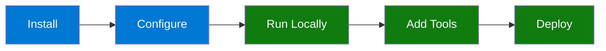
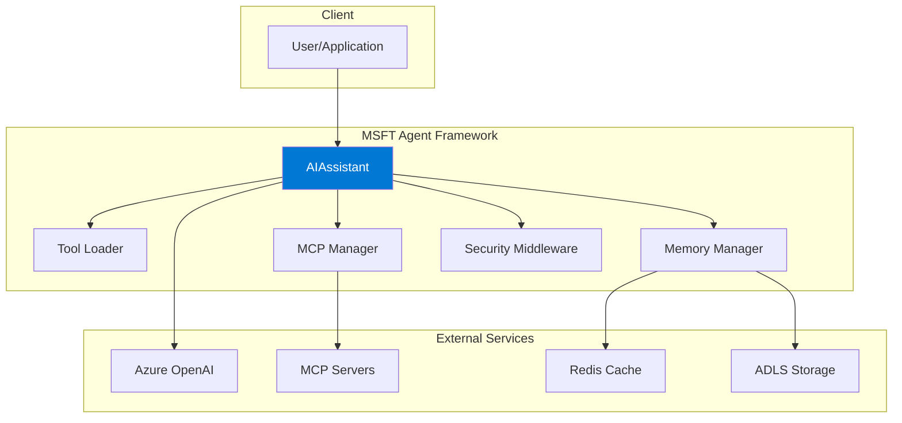

# MSFT Agent Framework Documentation

Welcome to the MSFT Agent Framework documentation. This guide will help you build, configure, and deploy AI agents using the Microsoft Agent Framework.

## Quick Navigation

| Getting Started | Guides | Reference |
|-----------------|--------|-----------|
| [Quickstart](getting-started/quickstart.md) | [Architecture](architecture.md) | [Config Reference](reference/config-reference.md) |
| [Installation](getting-started/installation.md) | [Tools](tools.md) | [API Reference](reference/api.md) |
| [Configuration](getting-started/configuration.md) | [Memory](memory.md) | [Environment Variables](reference/environment-variables.md) |

| Deployment | Integrations | Development |
|------------|--------------|-------------|
| [Overview](deployment/overview.md) | [Azure Setup](azure-setup.md) | [Contributing](development/contributing.md) |
| [Docker](deployment/docker.md) | [D365 MCP](integrations/d365-mcp-setup.md) | [Testing](development/testing.md) |
| [Kubernetes](deployment/kubernetes.md) | [MCP Integration](guides/mcp-integration.md) | [Troubleshooting](troubleshooting.md) |

---

## What is MSFT Agent Framework?

The MSFT Agent Framework is a production-ready template for building AI agents using the [Microsoft Agent Framework](https://learn.microsoft.com/en-us/agent-framework/overview/agent-framework-overview). It provides:

- **Dynamic Tool Loading** — Hybrid decorator + JSON tool discovery
- **Multi-Model Support** — Azure OpenAI, OpenAI, Anthropic, and more
- **MCP Integration** — Connect to external MCP servers
- **Multi-Agent Workflows** — Sequential and graph-based pipelines
- **Session Management** — Redis cache + ADLS persistence
- **Enterprise Features** — Observability, security, health checks

---

## Getting Started Path



### 1. Install (2 minutes)

```bash
git clone https://github.com/your-org/MSFT-AGENT-FRAMEWORK.git
cd MSFT-AGENT-FRAMEWORK
pip install -e .
```

### 2. Configure (1 minute)

```bash
cp config/agent.toml.example config/agent.toml
# Edit agent.toml with your Azure OpenAI details
```

### 3. Run (30 seconds)

```python
import asyncio
from src.agent import AIAssistant

async def main():
    async with AIAssistant() as assistant:
        result = await assistant.process_question("Hello!")
        print(result.response)

asyncio.run(main())
```

**Ready for more?** Follow the [Quickstart Guide](getting-started/quickstart.md).

---

## Documentation Sections

### Getting Started

New to the framework? Start here:

- **[Quickstart](getting-started/quickstart.md)** — 5-minute introduction
- **[Installation](getting-started/installation.md)** — Detailed setup instructions
- **[Configuration](getting-started/configuration.md)** — Configure your agent

### Guides

Learn how the framework works:

- **[Architecture](architecture.md)** — System design and components
- **[Tools](tools.md)** — Creating and loading tools
- **[Memory](memory.md)** — Session management with Redis + ADLS
- **[Security](security.md)** — Rate limiting, input validation, PII detection
- **[Observability](observability.md)** — Tracing and metrics
- **[MCP Integration](guides/mcp-integration.md)** — Connect to MCP servers
- **[Workflows](guides/workflows.md)** — Multi-agent pipelines

### Deployment

Deploy your agent:

- **[Deployment Overview](deployment/overview.md)** — Choose your deployment option
- **[Docker](deployment/docker.md)** — Container deployment
- **[Kubernetes](deployment/kubernetes.md)** — Production orchestration
- **[Azure Deployment](deployment/azure-deployment.md)** — Azure PaaS options
- **[Production Checklist](deployment/production-checklist.md)** — Pre-deployment verification

### Integrations

Connect to external systems:

- **[Azure Setup](azure-setup.md)** — Azure resource configuration
- **[D365 MCP Setup](integrations/d365-mcp-setup.md)** — Dynamics 365 integration

### Reference

Detailed specifications:

- **[Config Reference](reference/config-reference.md)** — Complete TOML reference
- **[API Reference](reference/api.md)** — AIAssistant API
- **[Environment Variables](reference/environment-variables.md)** — All env vars

### Development

Contribute to the project:

- **[Contributing](development/contributing.md)** — Development setup and guidelines
- **[Testing](development/testing.md)** — Running and writing tests
- **[Troubleshooting](troubleshooting.md)** — Common issues and solutions

---

## Key Concepts

### AIAssistant

The main entry point for interacting with the agent:

```python
async with AIAssistant() as assistant:
    # Single question
    result = await assistant.process_question("What's 2+2?")

    # Streaming response
    async for chunk in await assistant.process_question_stream("Tell me a story"):
        print(chunk.text, end="")

    # Run workflow
    result = await assistant.run_workflow("content-pipeline", "Write about AI")
```

### Tools

Extend agent capabilities with custom tools:

```python
from src.tools import ai_function, register_tool

@register_tool(tags=["utilities"])
@ai_function
def my_tool(query: str) -> str:
    """Do something useful."""
    return f"Result for {query}"
```

### Configuration

Configure via `config/agent.toml`:

```toml
[agent]
default_model = "azure_openai"

[[agent.models]]
name = "azure_openai"
provider = "azure_openai"
endpoint = "https://your-resource.openai.azure.com/"
deployment = "gpt-4o"
```

### Health Checks

Monitor agent health:

```python
health = await assistant.health_check()
# Returns: {"status": "healthy", "components": [...]}
```

---

## Architecture Overview



---

## Need Help?

- **[Troubleshooting Guide](troubleshooting.md)** — Common issues and solutions
- **[GitHub Issues](https://github.com/your-org/MSFT-AGENT-FRAMEWORK/issues)** — Report bugs or request features
- **[Architecture Docs](architecture.md)** — Understand the system design

---

## Version Information

- **Framework Version**: 1.0.0
- **Python Support**: 3.10, 3.11, 3.12
- **Last Updated**: 2026-01-17

---
*MSFT Agent Framework - Build intelligent AI agents with enterprise-grade features.*
