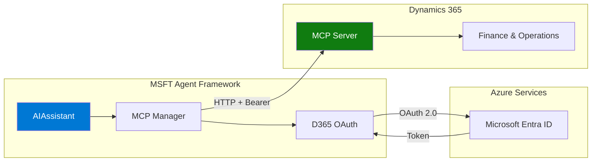

# Dynamics 365 F&O MCP Server Setup

This guide covers connecting the MSFT Agent Framework to Dynamics 365 Finance & Operations using the MCP (Model Context Protocol) server.

## Overview

The Dynamics 365 ERP MCP Server enables AI agents to interact with D365 Finance and Supply Chain Management. Agents can access data, navigate forms, and execute business logic — all through the MCP protocol.

### Architecture



### Key Benefits

- Agent access to D365 data and business logic
- Dynamic context based on user security permissions
- No custom code or API development required
- OAuth 2.0 authentication with automatic token refresh

---

## Prerequisites

### Dynamics 365 Requirements

| Requirement | Details |
|-------------|---------|
| **Product Version** | 10.0.2428.15 or higher |
| **Environment Tier** | Tier 2+, or Unified Developer Environment |
| **Environment Type** | Cloud Hosted Environments (CHE) are **NOT** supported |

### Azure Requirements

| Requirement | Details |
|-------------|---------|
| **Azure Subscription** | Active subscription |
| **Microsoft Entra ID** | Admin access for app registrations |

### Required Permissions

| System | Role |
|--------|------|
| Azure Portal | Application Administrator or Global Administrator |
| D365 F&O | System Administrator |

---

## Part 1: Microsoft Entra ID App Registration

### Step 1.1: Create App Registration

1. Sign in to the [Azure Portal](https://portal.azure.com)
2. Navigate to **Microsoft Entra ID** > **App registrations**
3. Click **+ New registration**
4. Configure:

| Field | Value |
|-------|-------|
| **Name** | `Dynamics365-ERP-MCP-Agent` |
| **Supported account types** | Single tenant |
| **Redirect URI** | Leave blank |

5. Click **Register**

### Step 1.2: Note Important Values

From the **Overview** page, copy:

| Value | Example |
|-------|---------|
| **Application (client) ID** | `xxxxxxxx-xxxx-xxxx-xxxx-xxxxxxxxxxxx` |
| **Directory (tenant) ID** | `yyyyyyyy-yyyy-yyyy-yyyy-yyyyyyyyyyyy` |

### Step 1.3: Create Client Secret

1. Go to **Certificates & secrets**
2. Click **+ New client secret**
3. Set description and expiration
4. Click **Add**
5. **Copy the Value immediately** (it won't be shown again)

### Step 1.4: Configure API Permissions

1. Go to **API permissions**
2. Click **+ Add a permission**
3. Select **APIs my organization uses**
4. Search for **Dynamics ERP**
5. Select **Delegated permissions**
6. Add these permissions:

| Permission | Description |
|------------|-------------|
| `mcp.tools` | Access MCP tools |
| `CustomService.FullAccess` | Custom services |
| `Odata.FullAccess` | OData access |
| `AX.FullAccess` | Full D365 access |

7. Click **Grant admin consent for [Your Tenant]**

---

## Part 2: Configure Dynamics 365

### Step 2.1: Enable MCP Feature

1. In D365, go to **System administration** > **Feature management**
2. Search for: `(Preview) Dynamics 365 ERP Model Context Protocol server`
3. Click **Enable now**

### Step 2.2: Register the Application

1. Navigate to **System administration** > **Setup** > **Microsoft Entra applications**
2. Click **+ New**
3. Configure:

| Field | Value |
|-------|-------|
| **Client ID** | Your Application ID |
| **Name** | `Agent MCP Connector` |
| **User ID** | Service account with appropriate roles |

### Step 2.3: Add to Allowed MCP Clients

1. Navigate to **System administration** > **Setup** > **Allowed MCP clients**
2. Click **+ New**
3. Add your Application (client) ID
4. Set **Allowed** to Yes

---

## Part 3: Configure MSFT Agent Framework

### Step 3.1: Add D365 MCP Configuration

In `config/agent.toml`:

```toml
[[agent.mcp]]
name = "d365-fo"
type = "d365"
enabled = true
description = "D365 Finance & Operations"
timeout = 60

[agent.mcp.oauth]
environment_url = "https://your-org.operations.dynamics.com"
tenant_id = "your-tenant-id"
client_id = "your-client-id"
client_secret = "${D365_CLIENT_SECRET}"
```

### Step 3.2: Set Environment Variable

```bash
export D365_CLIENT_SECRET="your-client-secret-value"
```

### Step 3.3: Test the Connection

```python
import asyncio
from src.agent import AIAssistant

async def test_d365():
    async with AIAssistant() as assistant:
        # Check health
        health = await assistant.health_check()
        for c in health.components:
            if "d365" in c.name.lower():
                print(f"D365: {c.status} - {c.message}")

        # Test query
        result = await assistant.process_question(
            "What purchase orders are open in D365?"
        )
        print(result.response)

asyncio.run(test_d365())
```

---

## Available MCP Tools

The D365 MCP Server provides these tools:

| Tool | Description |
|------|-------------|
| `find_menu_item` | Find menu items in the application |
| `open_menu_item` | Open a form |
| `click_control` | Select a control on a form |
| `close_form` | Close the current form |
| `filter_form` | Apply form filters |
| `filter_grid` | Filter grid data |
| `find_actions` | Find available actions |
| `invoke_action` | Execute an action |
| `open_lookup` | Open a lookup control |
| `open_or_close_tab` | Toggle form tabs |
| `save_form` | Save the form |
| `select_grid_row` | Select a grid row |
| `set_control_value` | Set a field value |
| `sort_grid_column` | Sort grid columns |

### Key Behaviors

1. **25 Row Limit**: D365 MCP returns max 25 rows per query
2. **Object Names**: Use object names, not labels, for controls
3. **Tabs**: Tabs are closed by default — call `open_or_close_tab` first
4. **Session State**: Forms maintain state across tool calls

---

## Agent Instructions Template

Configure your agent with these instructions for D365:

```markdown
# Role
Act as a data retrieval agent for Dynamics 365 Finance and Supply Chain Management.

# Form Tool Usage
- Typical flow: find_menu_item → open_menu_item → interact with form → save_form
- Use grid filtering to find records
- Use object names (not labels) for controls

# Important Notes
- Tool responses can include up to 25 rows
- Tabs are closed by default - open them to access controls
- Dates use ISO format (YYYY-MM-DD)

# Reasoning
- Plan each tool call before executing
- Continue until task is complete or error prevents continuation
- Use tools to find data - do not rely on general knowledge
```

---

## Health Monitoring

The framework includes D365-specific health checks:

```python
async def check_d365_health(assistant):
    health = await assistant.health_check()
    for component in health.components:
        if "d365" in component.name.lower():
            print(f"Status: {component.status}")
            if component.details:
                print(f"  Tools: {component.details.get('tool_count', 0)}")
                print(f"  Environment: {component.details.get('environment_url')}")
            if component.status != "healthy":
                print(f"  Issue: {component.message}")
```

Health checks verify:
- OAuth token validity (refreshes if needed)
- MCP connection status
- Circuit breaker state
- Available tools

---

## Troubleshooting

### Common Errors

#### "401 Unauthorized"

**Solutions:**
1. Verify Client ID and Secret are correct
2. Check admin consent is granted
3. Verify the D365 user has required roles

#### "No tools found"

**Solutions:**
1. Verify MCP feature is enabled in D365
2. Check Client ID is in Allowed MCP clients
3. Verify environment version is 10.0.2428.15+

#### "Connection timeout"

**Solutions:**
1. Increase timeout in configuration
2. Check network connectivity to D365
3. Verify environment URL is correct

#### "Token refresh failed"

**Solutions:**
1. Regenerate client secret
2. Update `D365_CLIENT_SECRET` environment variable
3. Verify tenant ID is correct

### Verification Checklist

| Step | Component | Status |
|------|-----------|--------|
| 1 | App Registration created | |
| 2 | Client secret created | |
| 3 | API permissions granted (with admin consent) | |
| 4 | MCP feature enabled in D365 | |
| 5 | App registered in D365 Microsoft Entra applications | |
| 6 | Client ID in Allowed MCP clients | |
| 7 | Configuration added to agent.toml | |
| 8 | D365_CLIENT_SECRET environment variable set | |

---

## Known Limitations

| Limitation | Details |
|------------|---------|
| **Language** | Only US English (en-us) fully supported |
| **Dates** | ISO format only, not user locale |
| **Controls** | Calendar, org chart, HTML editor not supported |
| **Reports** | Output menu items (reports) not supported |
| **System Admin** | Security and user management forms excluded |

---

## References

### Microsoft Documentation

- [Use MCP for F&O apps](https://learn.microsoft.com/en-us/dynamics365/fin-ops-core/dev-itpro/copilot/copilot-mcp)
- [Build an agent with D365 ERP MCP](https://learn.microsoft.com/en-us/dynamics365/fin-ops-core/dev-itpro/copilot/build-agent-mcp)
- [Register an app in Microsoft Entra ID](https://learn.microsoft.com/en-us/entra/identity-platform/quickstart-register-app)

---

## Related Documentation

- [MCP Integration Guide](../guides/mcp-integration.md) — General MCP configuration
- [Config Reference](../reference/config-reference.md) — D365 MCP configuration options
- [Security](../security.md) — Security best practices

---
*Last updated: 2026-01-17*
